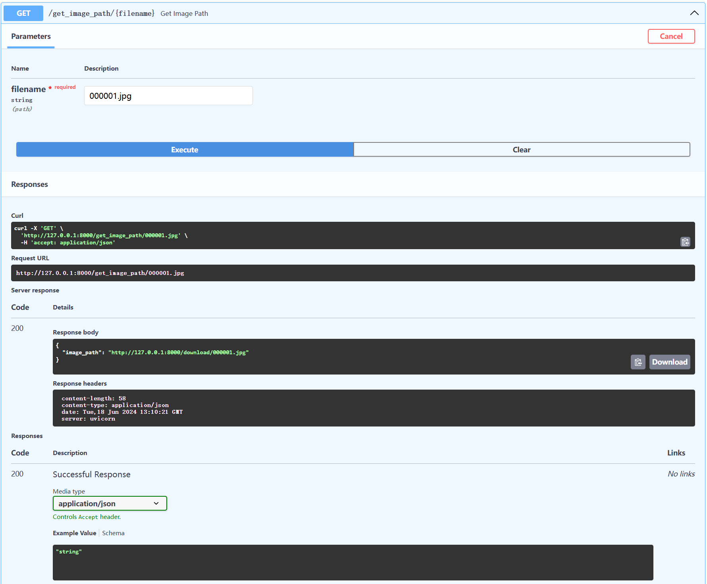
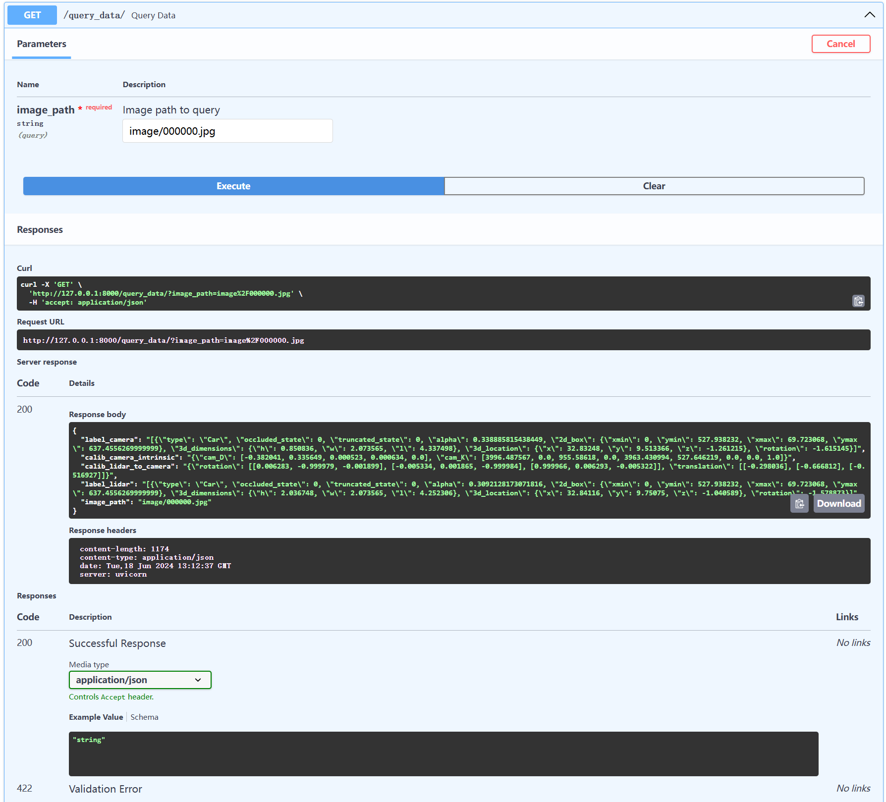

## 总结
本次大作业写的过程还是遇到了一些问题，但好在查询过资料并学习后做完了作业。我的作业流程还有可以改进的地方，我在处理关联文件时给每个文件都创建了一个程序，这里可以简略为一个程序文件。在进行数据集下载时，因为直接用飞书文档里提供的链接用python没有成功下载数据集，最后是通过网页检查的方法才找到了数据集下载的链接。因为本次作业的数据集并没有缺失值，实际上是简化了做作业的步骤，如果之后遇到有缺失值和异常值的数据，应该会是新的挑战，所以还需要继续学习。

## api整体效果展示：

该图包含了三个路由的展示效果  
## download file

点击图中的Download file即可下载该图片  
## download url

获取图片下载的http地址  
## query

输入图片的地址，可以获取关联的 lidar/\*.json的json数据、返回关联的calib/\*/*.json数据
